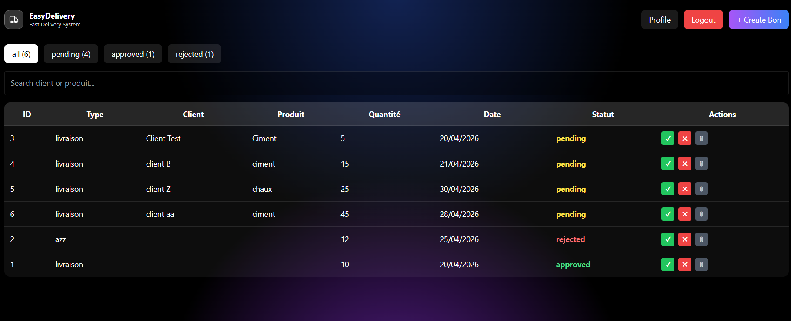
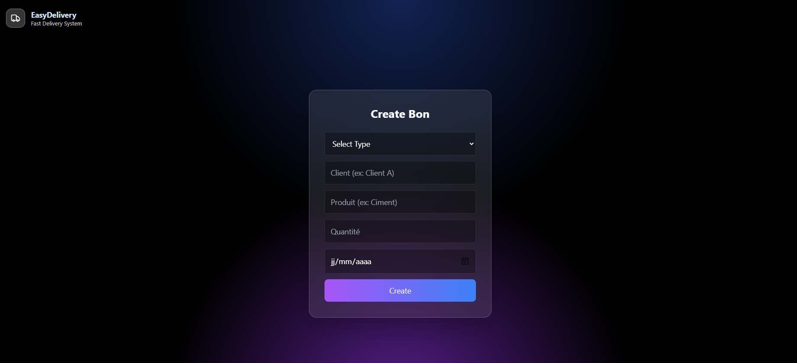

# 🚚 EasyDelivery - Management System

EasyDelivery is a full-stack web application for managing delivery slips (bons de livraison).  
It provides authentication, role-based access structure, and full CRUD operations for delivery management.

---

## 🚀 Tech Stack

**Frontend:**
- React.js
- Axios
- React Router

**Backend:**
- Node.js
- Express.js
- JWT Authentication
- bcrypt.js

**Database:**
- PostgreSQL

---

## 🎯 Features

### 🔐 Authentication
- User registration & login
- JWT-based authentication

### 📦 Delivery Management
- Create delivery slips (bons)
- View all delivery slips
- Filter by status: pending / approved / rejected
- Update status (approved / rejected)
- Delete delivery slips

### 👤 Role-Based Architecture
- User system implemented
- JWT includes user identity
- Backend ready for admin role extension
- Admin features structure prepared (access control ready)
## 📷 Screenshots

### Dashboard


### Create Bon

---
## 👤 Roles

- User: create & view bons  
- Admin: manage bons (structure ready)
  ---
## ⚙️ Setup
```bash
git clone <repo>
cd backend && npm install && npm start
cd frontend && npm install && npm start
